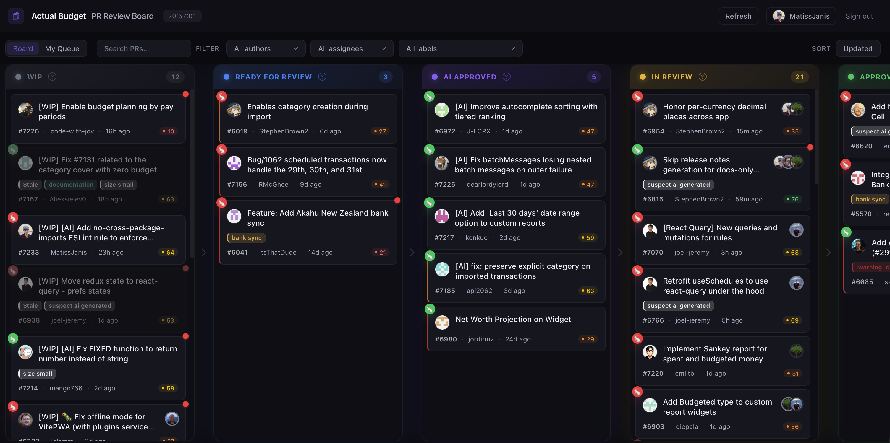

# Maintainer Dashboard

A real-time Kanban board for triaging pull requests on [actualbudget/actual](https://github.com/actualbudget/actual).



## Features

- **Board view** — 5-column Kanban: WIP, Ready for Review, AI Approved, In Review, Approved
- **My Queue** — toggle to show only PRs assigned to you
- **Merge score** — composite 0–100 score predicting merge likelihood (author history, PR size, review progress, org membership)
- **CI status** — live check-run indicators with drill-down popover
- **CodeRabbit** — automatic detection of AI review status
- **Filtering** — filter by author, reviewer, label, or column via URL-persisted search params
- **Auto-refresh** — polls GitHub every 2 minutes
- **Dark theme** — custom dark design with Satoshi font and glass-card aesthetics

## Tech Stack

| Layer       | Technology        |
| ----------- | ----------------- |
| UI          | React 18          |
| Language    | TypeScript 5.7    |
| Build       | Vite 6.1          |
| Styling     | Tailwind CSS 4.1  |
| GitHub API  | Octokit           |
| Hosting     | Netlify           |

## Getting Started

### Prerequisites

- Node.js 20+
- Yarn
- A GitHub OAuth App (for authentication)

### Install

```bash
git clone https://github.com/actualbudget/reviewer-dashboard.git
cd reviewer-dashboard
yarn install
```

### Environment

Copy `.env.example` to `.env` and fill in values:

```bash
cp .env.example .env
```

| Variable                | Side   | Description                          |
| ----------------------- | ------ | ------------------------------------ |
| `VITE_GITHUB_CLIENT_ID` | Client | GitHub OAuth App client ID           |
| `GITHUB_CLIENT_ID`      | Server | Same client ID (for Netlify Function)|
| `GITHUB_CLIENT_SECRET`  | Server | GitHub OAuth App client secret       |
| `SITE_URL`              | Server | Your deployed site URL               |

### Development

```bash
yarn dev          # starts Netlify Dev (Vite + serverless functions on :8888)
```

> **Note:** Use `yarn dev` (which runs `netlify dev`), not `yarn vite`. The OAuth callback requires the Netlify Functions proxy.

## Architecture

```
src/
├── App.tsx                  # Root: auth gate + data fetching orchestration
├── types.ts                 # Shared TypeScript interfaces
├── constants.ts             # Repo config, column metadata, intervals
├── index.css                # Tailwind v4 import + theme tokens + animations
├── components/
│   ├── Board.tsx            # Column layout container
│   ├── Column.tsx           # Single Kanban column
│   ├── PRCard.tsx           # Pull request card
│   ├── PRPopover.tsx        # Detailed PR info popover
│   ├── FilterBar.tsx        # Author/reviewer/label/column filters
│   ├── Header.tsx           # Top bar with refresh + My Queue toggle
│   ├── MyQueue.tsx          # Filtered view of assigned PRs
│   ├── LabelBadge.tsx       # Colored label chip
│   ├── LoginScreen.tsx      # GitHub OAuth login
│   └── Spinner.tsx          # Loading indicator
├── hooks/
│   ├── useAuth.ts           # OAuth token management
│   ├── usePullRequests.ts   # Main data-fetching hook
│   ├── useSearchParams.ts   # URL ↔ state sync via useSyncExternalStore
│   └── useTimelineEvents.ts # PR timeline event fetching
├── contexts/
│   └── TokenContext.tsx      # Auth token context provider
└── lib/
    ├── github.ts            # Octokit wrapper, all GitHub API calls
    ├── classify.ts          # PR → column classification logic
    ├── mergeScore.ts        # Merge likelihood scoring algorithm
    ├── concurrency.ts       # Bounded-concurrency Promise helper
    ├── mergeCache.ts        # localStorage cache for merge stats
    ├── scoreColors.ts       # Score → color mapping
    └── format.ts            # Date/number formatting utilities

netlify/
└── functions/
    └── auth-callback.ts     # OAuth code → token exchange
```

### Data Flow

1. User authenticates via GitHub OAuth (token exchanged through Netlify Function)
2. `usePullRequests` fetches all open PRs, reviews, CI checks, and merge stats concurrently
3. `classify.ts` assigns each PR to a column based on labels, review state, and assignees
4. `mergeScore.ts` computes a composite score from author history, PR size, and review progress
5. Board re-fetches every 2 minutes; merge stats are cached in localStorage for 30 minutes

## Deployment

Deployed on Netlify. See `netlify.toml` for build and redirect configuration.

## License

[MIT](LICENSE)
